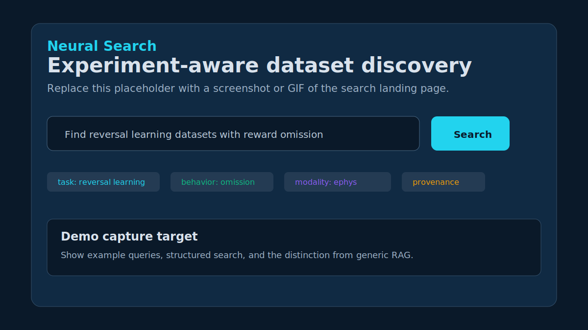

# Neural Search

Experiment-aware search for reusable neural and behavioral datasets.

Neural Search is a technical demo of scientific discovery that understands experiments, not just documents. It combines a behavioral task ontology, structured metadata, embedding-style semantic matching, and provenance-aware dataset cards so researchers can ask for the data they need in experimental terms.

This is not generic RAG. The system does not retrieve chunks and synthesize an answer as the primary artifact. It retrieves datasets, explains why they match, exposes missing metadata, links literature evidence, and generates dataset cards plus starter notebooks for concrete reuse.



## Demo Narrative

Use Neural Search to show five capabilities:

1. **Experiment-aware search**: Query by task, behavior, modality, species, brain region, data standard, and intended analysis.
2. **Ontology plus embeddings**: Normalize synonyms such as "go/no-go", "response inhibition", "Neuropixels", and "choice decoding" into searchable scientific labels.
3. **Metadata plus provenance**: Keep source archive IDs, linked papers, extraction evidence, QA status, and missing metadata visible.
4. **Dataset cards and notebooks**: Generate reuse cards and starter notebooks instead of only returning links.
5. **Evaluation surface**: Show benchmark queries, expected labels, top results, warnings, and recommendations.

The future direction is **latent neural-state search**: searching across learned representations of neural population state, task structure, and behavior, while preserving the current ontology and provenance layer as the interpretability scaffold.

## What Is In This Repo

```text
neural-search/
├── apps/
│   ├── api/                 FastAPI demo backend
│   └── web/                 React + Vite frontend
├── neural_search/
│   ├── ingestion/           Demo fixtures and source connectors
│   ├── ontology/            Behavioral task ontology loader/matcher
│   ├── search/              Hybrid retrieval and query parsing
│   ├── cards/               Dataset-card generation
│   ├── notebooks/           Starter notebook generation
│   ├── evaluation/          Benchmark runner and reports
│   └── reports/             Dataset compilation reports
├── data/
│   ├── ontology/            Task, behavior, modality, and region vocabulary
│   ├── seed/                Demo datasets and papers
│   ├── eval/                Benchmark queries
│   ├── notebooks/           Generated notebook examples
│   └── reports/             Generated corpus reports
└── docs/                    Demo, architecture, evaluation, and limitations
```

## Quick Start

Prerequisites:

- Python 3.11+
- Node.js 20+ recommended
- Docker is optional. The public demo path runs from in-memory/demo seed data.

Install dependencies:

```bash
python -m pip install -e ".[all]"
cd apps/web
npm install
cd ../..
```

Run the one-command demo:

```bash
make demo
```

Start the local app:

```bash
# Terminal 1
make api

# Terminal 2
make web
```

Open http://localhost:5173.

If the frontend cannot reach the API, confirm the API is on http://localhost:8000 and restart `make web`. The Vite dev server proxies `/api` and `/healthz` to the backend.

## Demo Queries

These are tuned to communicate experiment-aware retrieval:

- `Find reversal learning datasets with reward omission and trial outcomes`
- `Go/NoGo task with calcium imaging in mPFC and lick events`
- `Visual decision-making with Neuropixels recordings`
- `Find datasets where I can decode choice from neural activity`
- `Human ECoG or iEEG reaching data for BCI classification`
- `Delay discounting with fiber photometry and reward choice`

Structured search fields in the UI let you combine free text with explicit task, behavior, modality, brain region, source archive, data standard, and readiness filters.

## Core Commands

| Command | Purpose |
| --- | --- |
| `make demo` | Run ontology load, demo seed, cards, benchmark, report, notebook, and sample search |
| `make api` | Start the FastAPI backend on port 8000 |
| `make web` | Start the Vite frontend on port 5173 |
| `make demo-search QUERY="..."` | Run a single CLI search |
| `make benchmark` | Run benchmark queries and write reports |
| `make reports` | Generate dataset compilation report |
| `make notebook-generate DATASET_ID=DEMO_GONOGO_CALCIUM` | Generate a starter notebook |
| `make test-backend` | Run the quick backend test suite |
| `make build` | Type-check and build the frontend |

## API Highlights

| Endpoint | Method | Description |
| --- | --- | --- |
| `/healthz` | GET | Backend health check |
| `/api/search` | POST | Experiment-aware dataset search |
| `/api/datasets` | GET | List indexed demo datasets |
| `/api/datasets/{id}/card` | GET | Dataset card with readiness, provenance, and QA |
| `/api/datasets/{id}/notebook` | POST | Generate a starter notebook |
| `/api/datasets/{id}/card/export/markdown` | GET | Export reuse card as Markdown |
| `/api/ontology/tasks` | GET | Ontology terms for the UI |
| `/api/evaluation/report` | GET | Latest in-process benchmark report |
| `/api/evaluation/run` | POST | Run benchmark evaluation |
| `/api/reports/compilation` | GET | Dataset compilation and QA report |

## Documentation

- [Demo walkthrough](docs/demo_walkthrough.md)
- [Project vision](docs/project_vision.md)
- [Technical architecture](docs/technical_architecture.md)
- [Evaluation](docs/evaluation.md)
- [Ingestion](docs/ingestion.md)
- [Example queries](docs/example_queries.md)
- [Known limitations](docs/known_limitations.md)
- [Retrieval notes](docs/retrieval.md)
- [Dataset-card review checklist](docs/dataset_card_review_checklist.md)

## Current Scope

The repository is demo-first. It uses curated demo records and local generated artifacts to make the full product loop inspectable: search, match explanation, dataset card, notebook, benchmark, and report. Production ingestion, durable indexing, authenticated QA workflows, and large-scale embedding infrastructure are intentionally future work.

## License

MIT
