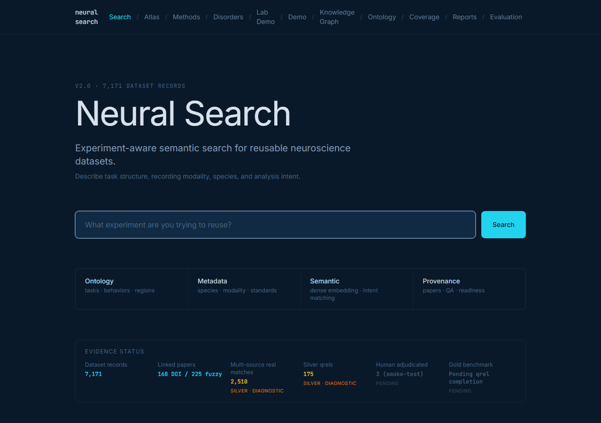
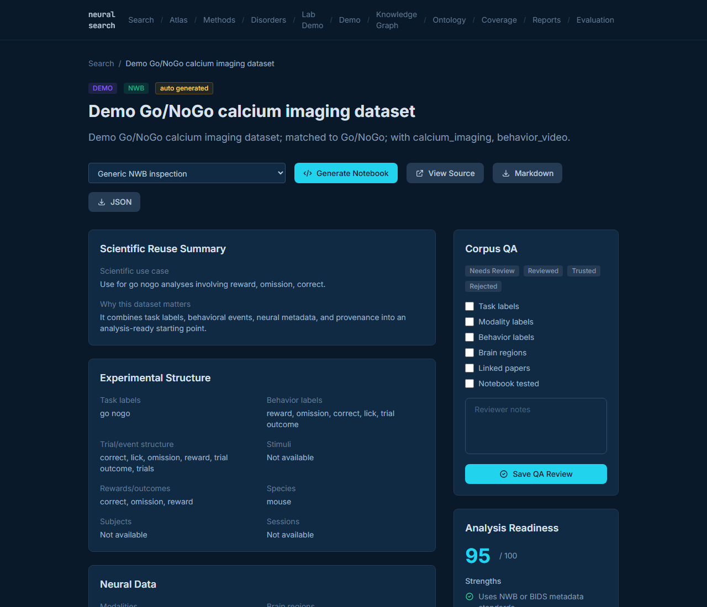
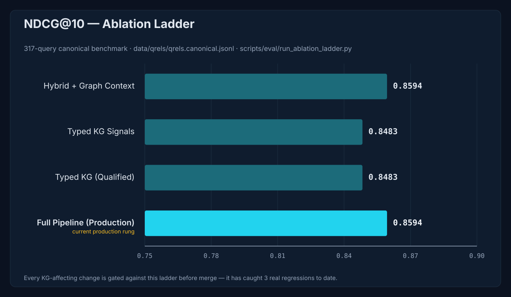

# Neural Search

Experiment-aware discovery and reuse infrastructure for neuroscience datasets, literature, methods, and derived knowledge.

Neural Search is an alpha research platform for finding reusable neural and behavioral data in experimental terms rather than only by document keywords. It combines structured scientific metadata, behavioral and anatomical normalization, semantic retrieval, provenance-aware dataset cards, literature links, knowledge-graph signals, and evaluation tooling.

The repository is designed to support several kinds of users without forcing all of them into the same heavyweight environment. A first-time evaluator can run a deterministic portable demo, a researcher can attach a real local corpus, an infrastructure contributor can rebuild corpus/graph/index assets, and an evaluator can reproduce retrieval experiments with explicit evidence and artifact state.

This is not generic RAG. The primary artifact is not a synthesized answer over retrieved chunks. Neural Search retrieves datasets and evidence, explains why they match, exposes missing metadata and evidence quality, links relevant literature and methods, and supports concrete reuse workflows.



## What value does it provide?

1. **Search experiments, not filenames**: query by task, behavior, modality, species, brain region, data standard, intended analysis, and reuse constraints.
2. **Normalize scientific language**: map synonyms and related experimental concepts into searchable structured fields.
3. **Inspect provenance and uncertainty**: preserve source archive IDs, literature evidence, QA state, missing metadata, and evidence tiers instead of hiding them behind a score.
4. **Generate reuse artifacts**: produce dataset cards and starter notebooks for concrete follow-up work.
5. **Explore linked knowledge**: connect datasets, papers, findings, methods, regions, and other scientific concepts through graph-backed interfaces and derived relationships.
6. **Evaluate retrieval scientifically**: keep benchmarks, qrels, hard negatives, ablations, artifact manifests, and calibration machinery separate from product demos.
7. **Expose capability state**: tell users which corpus, graph, embedding, or evaluation assets are actually available instead of failing later on an assumed local file.

| Dataset card, provenance, and QA | Ablation-ladder benchmark (NDCG@10) |
|---|---|
|  |  |

The longer-term direction is **latent neural-state search**: searching across learned representations of neural population state, task structure, behavior, and analysis affordances while retaining ontology and provenance layers as an interpretability scaffold.

## Choose an execution profile

Neural Search is intentionally not one runtime. Use the smallest profile that supports the job you are doing.

| Profile | Intended user | Install | Portable in a fresh clone? |
| --- | --- | --- | --- |
| `demo` | New users, teaching, product evaluation, contributors | `make setup` | Yes |
| `researcher` | Real-corpus dataset/literature discovery and reuse | `make install-researcher` | Requires local research corpus |
| `corpus-builder` | Source ingestion, normalization, graph/index construction | `make install-corpus-builder` | Requires local/downloaded raw inputs |
| `evaluator` | Retrieval metrics, qrels, regression checks | `make install-evaluator` | Canonical baseline is portable; full ablations need local assets |
| `full-stack` | Maintainers operating all services and research assets | `make install-full-stack` | No |

Inspect the contract before using a profile:

```bash
neural-search profile list
neural-search profile show researcher
neural-search profile check researcher
neural-search artifacts status
```

See [Execution profiles](docs/execution_profiles.md) and [Artifact registry](docs/artifact_registry.md) for the complete dependency and reproducibility model.

## Repository map

```text
neural-search/
├── apps/
│   ├── api/                 FastAPI transport + application composition
│   └── web/                 React + Vite research interface
├── neural_search/           Core Python package
│   ├── runtime/             Execution profiles and artifact contracts
│   ├── ingestion/           Source adapters and normalization
│   ├── ontology/            Scientific vocabulary and matching
│   ├── search/              Retrieval, ranking, and query parsing
│   ├── graph/               Knowledge-graph schemas and features
│   ├── literature/          Findings, linking, and evidence processing
│   ├── evaluation/          Benchmarks and evaluation utilities
│   ├── cards/               Dataset-card generation
│   └── notebooks/           Starter notebook generation
├── scripts/                 Reproducible ingestion/evaluation/build jobs
├── tests/                   Unit, integration, artifact, and adoption safety tests
├── data/                    Portable fixtures plus local research-asset locations
├── reports/                 Generated and frozen evaluation/report artifacts
└── docs/                    Architecture, evaluation, limitations, and whitepaper
```

## Quick start: evaluate Neural Search from a clean clone

### Prerequisites

- Python 3.11+
- Node.js 20+
- Git
- Docker only if you want the optional service stack

### 1. Create an isolated environment

```bash
git clone https://github.com/sidhulyalkar/neural-search.git
cd neural-search
python -m venv .venv
source .venv/bin/activate  # Windows: .venv\Scripts\activate
python -m pip install --upgrade pip
```

### 2. Follow the portable setup path

```bash
make setup
neural-search profile check demo
```

`make setup` intentionally installs the portable demo/contributor environment rather than every optional database, vector-index, and analysis dependency.

For a broader diagnostic:

```bash
neural-search doctor --profile demo
```

### 3. Run the complete portable user journey

```bash
make demo
```

The demo exercises ontology loading, fixture ingestion, dataset-card generation, local database seeding, retrieval evaluation, report generation, starter-notebook generation, and an example experiment-aware search.

GitHub Actions repeats this same clean-checkout path in the `adoption-smoke` job. Portability is therefore a tested repository contract rather than only a README claim.

### 4. Start the application

```bash
# Terminal 1
make api

# Terminal 2
make web
```

Open `http://localhost:5173`. The Vite development server proxies `/api` and `/healthz` to the backend on `http://localhost:8000`.

The API can report its execution/artifact state through `/api/runtime/*`, which lets deployments and the frontend explain unavailable capabilities before a user hits a missing-asset error.

## Move from demo to real research use

For interactive discovery over a real local corpus:

```bash
make install-researcher
neural-search profile check researcher
NEURAL_SEARCH_PROFILE=researcher make api
make web
```

A researcher profile requires the current normalized corpus and reports graph, dense embeddings, and literature artifacts separately as recommended capability upgrades. If a required generated asset is absent, `profile check` reports that explicitly and includes a repair command when one canonical rebuild command exists.

For corpus/index construction:

```bash
make install-corpus-builder
neural-search profile check corpus-builder
python scripts/corpus/build_full_corpus.py
python scripts/rebuild_full_corpus_graph.py
python scripts/recompute_embeddings.py --provider dense
```

For retrieval evaluation:

```bash
make install-evaluator
neural-search profile check evaluator
make benchmark
```

The canonical benchmark queries and qrels travel with the repository. More expensive dense/graph ablations additionally require generated local artifacts.

## Record the state behind a result

Create a reproducibility manifest whenever artifact state matters to an experiment or report:

```bash
neural-search profile manifest demo \
  --output reports/reproducibility/demo.json
```

or:

```bash
make repro-manifest PROFILE=demo
```

The manifest captures the execution profile, Git commit when available, Python/platform information, dependency readiness, registered artifact state, and checksums for reasonably sized files. It does not record secret values.

This complements `scripts/build_artifact_manifest.py`: the runtime registry describes **what assets a capability expects**, while the scientific artifact manifest measures **what is inside the current corpus/graph/evaluation state**.

## Example queries

- `Find reversal learning datasets with reward omission and trial outcomes`
- `Go/NoGo task with calcium imaging in mPFC and lick events`
- `Visual decision-making with Neuropixels recordings`
- `Find datasets where I can decode choice from neural activity`
- `Human ECoG or iEEG reaching data for BCI classification`
- `Delay discounting with fiber photometry and reward choice`

The web interface also supports structured task, behavior, modality, brain-region, source, data-standard, and readiness filters.

## Core commands

| Command | Purpose |
| --- | --- |
| `neural-search doctor --profile demo` | Diagnose the environment for a declared operating mode |
| `neural-search profile list` | List supported execution profiles |
| `neural-search profile check <profile>` | Validate dependencies and required artifacts |
| `neural-search artifacts status` | Inspect portable vs generated artifact availability |
| `neural-search profile manifest <profile>` | Emit reproducibility state for a run/environment |
| `make demo` | Run the deterministic end-to-end portable workflow |
| `make api` | Start the FastAPI backend on port 8000 |
| `make web` | Start the Vite frontend on port 5173 |
| `make demo-search QUERY="..."` | Run a single CLI search |
| `make benchmark` | Run the portable retrieval benchmark |
| `make reports` | Generate the dataset compilation report |
| `make notebook-generate DATASET_ID=DEMO_GONOGO_CALCIUM` | Generate a starter notebook |
| `make test-backend` | Run the quick backend test suite |
| `make build` | Type-check and build the frontend |

## Artifact boundaries

A clean checkout intentionally does **not** contain every research asset. The runtime registry distinguishes four lifecycle classes:

- `committed_fixture`: small deterministic demo/test assets that must travel with the code;
- `frozen_evaluation`: versioned scientific evaluation inputs that must travel with the code;
- `generated_local`: large/downloaded/derived corpora, graphs, embeddings, and literature assets that may be absent;
- `derived_report`: recomputable summaries of local state.

This prevents two opposite mistakes: treating a missing production graph as a broken demo, or treating a missing committed qrels file as a harmless optional condition.

See [Artifact registry](docs/artifact_registry.md) for contribution rules and the planned path toward immutable, versioned artifact releases.

## API architecture

The API is being migrated from a large legacy route module toward an explicit composition/service boundary. `apps/api/application.py` is the composition root for new infrastructure and domain routers, while existing `apps.api.main` behavior remains compatible during incremental extraction.

The target is:

```text
HTTP routers
    ↓
application services / user goals
    ↓
search · graph · literature · evaluation domain logic
    ↓
artifact/infrastructure boundaries
```

This matters beyond code cleanliness. It allows the same scientific use cases to be called from the web UI, CLI, notebooks, agents, and workers without copying FastAPI route logic.

See [API and service boundaries](docs/architecture/service_boundaries.md).

## Quality gate

Before opening or merging a PR, run:

```bash
bash scripts/quality_gate.sh
```

The gate verifies dependencies, portable profile contracts, a reproducibility manifest, backend tests, Ruff, the frontend build, retrieval benchmark, and compilation report. GitHub Actions additionally runs a clean-checkout adoption smoke journey.

A green engineering gate does **not** automatically validate a scientific claim. Retrieval/ranking changes should be accompanied by the relevant benchmark or ablation evidence, and silver/heuristic labels must not be presented as expert gold judgments.

Common failures:

- Missing `ruff`: run `python -m pip install -e ".[dev]"`.
- Frontend dependency mismatch: run `cd apps/web && npm ci`.
- Missing generated research asset: run `neural-search artifacts status` or the relevant `profile check` before rebuilding anything.
- Missing portable fixture/evaluation asset: treat this as a repository/release problem rather than skipping the check.
- Benchmark failures on specific queries: inspect the generated evaluation report for missed labels and hard-negative violations.

## API highlights

| Endpoint | Method | Description |
| --- | --- | --- |
| `/healthz` | GET | Backend health check |
| `/api/runtime/profiles` | GET | Supported and active execution profiles |
| `/api/runtime/status` | GET | Dependency/artifact readiness for a profile |
| `/api/runtime/artifacts` | GET | First-class artifact registry status |
| `/api/search` | POST | Experiment-aware dataset search |
| `/api/datasets` | GET | List indexed datasets available to the active runtime |
| `/api/datasets/{id}/card` | GET | Dataset card with readiness, provenance, and QA |
| `/api/datasets/{id}/notebook` | POST | Generate a starter notebook |
| `/api/datasets/{id}/card/export/markdown` | GET | Export reuse card as Markdown |
| `/api/ontology/tasks` | GET | Ontology terms for the UI |
| `/api/evaluation/report` | GET | Latest in-process benchmark report |
| `/api/evaluation/run` | POST | Run benchmark evaluation |
| `/api/reports/compilation` | GET | Dataset compilation and QA report |

Additional routers expose graph, knowledge, coverage, atlas, methods, spectral, timeline, and ExperimentGlancer functionality. Treat the generated OpenAPI schema from a running backend as the authoritative endpoint contract.

## Documentation

- [Execution profiles](docs/execution_profiles.md)
- [Artifact registry](docs/artifact_registry.md)
- [API and service boundaries](docs/architecture/service_boundaries.md)
- [Demo walkthrough](docs/demo_walkthrough.md)
- [Project vision](docs/project_vision.md)
- [Technical architecture](docs/technical_architecture.md)
- [Evaluation](docs/evaluation.md)
- [Ingestion](docs/ingestion.md)
- [Example queries](docs/example_queries.md)
- [Known limitations](docs/known_limitations.md)
- [Retrieval notes](docs/retrieval.md)
- [Dataset-card review checklist](docs/dataset_card_review_checklist.md)
- [Contributing](CONTRIBUTING.md)
- [Security policy](SECURITY.md)

## Project status and scientific scope

Neural Search is alpha research software, not a validated clinical or diagnostic system. The repository deliberately combines a portable product/evaluation surface with larger research pipelines and generated scientific assets. A successful demo proves that the product loop runs; it does not prove that every research corpus, graph edge, or suggested reanalysis is scientifically valid.

When interpreting results, distinguish:

- demo fixtures from large-corpus results;
- heuristic/silver labels from expert/gold judgments;
- retrieval metrics from downstream scientific validity;
- a linked paper or method from evidence that a new analysis is scientifically appropriate;
- metadata availability from dataset quality or participant-level consent for a new use.

See `docs/known_limitations.md` and the evaluation documentation before using repository outputs in research claims.

## Contributing and citation

Contributions are welcome. Start with [CONTRIBUTING.md](CONTRIBUTING.md), declare the execution profile and artifact impact of changes, and preserve provenance plus evidence-tier distinctions when changing scientific logic.

Citation metadata is provided in `CITATION.cff`. If a corresponding paper becomes the canonical citation, that file should be updated rather than leaving users to infer how to cite the software.

## License

MIT. See [LICENSE](LICENSE).
