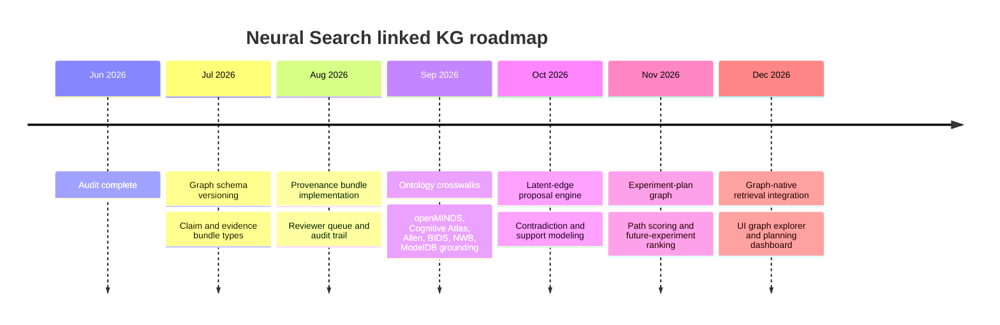

# Development Plan for the Next Generation Linked Knowledge Graph in Neural Search

## Executive summary

The `sidhulyalkar/neural-search` repository is already farther along than a conventional “search demo.” It contains a meaningful experimental retrieval stack, a provenance-aware file-backed graph schema, source-specific ingestion modules, structured normalization schemas, rule-based scientific label extraction, analysis-affordance detection, benchmark evaluation, and a broad automated test suite. It is best understood today as a **demo-first neuroscience discovery platform with an emerging graph substrate**, not yet as a full multi-layer knowledge graph operating system. The most important evidence is in the repo’s own stated scope and architecture: the system is “demo-first,” uses curated in-memory records in the public path, relies on configurable and interpretable retrieval rather than trained retrieval end-to-end, and explicitly lists durable indexing, persistent QA, claim-level provenance, and latent neural-state search as future work. citeturn35view3turn12view5turn33view1turn33view4

The strongest current assets for a next-generation KG are already present in code: a typed graph schema with dozens of node and edge categories, graph evidence objects, normalized dataset and paper records, analysis-affordance nodes, retrieval-run/query/judgment node types, optional embedding infrastructure, and many tests spanning graph building, graph search features, field-state memory, ingestion, evaluation, and retrieval quality. The most important absences are equally clear: there are **no explicit claim nodes**, no contradiction model, no temporal or causal relation system, no lifecycle for latent/derived edges, no experiment-plan objects, no cross-source ontology alignment layer, and no full claim-level citation graph. Those are exactly the additions needed to support the higher-order KG you described earlier: latent relationships, computational methods, behaviors, planning, and future experiment design. citeturn25view0turn24view5turn21view5turn15view0turn33view7

My top recommendation is to treat the current repository as **Phase Zero of a multi-layer neuroscience planning graph** and extend it in three directions at once. First, deepen the core KG schema with claim, evidence bundle, method, protocol, task contrast, dataset split, subject cohort, coordinate space, atlas, workflow, simulation, and experiment-plan objects. Second, separate relation quality into observed, inferred, and latent tiers with explicit provenance, calibration, review state, and expiration. Third, move from dataset-centric retrieval to **graph-native experimental planning**, where a user query can retrieve not only datasets but also supporting papers, modeling workflows, standards-compliant preprocessing templates, comparable paradigms, negative evidence, known confounds, and ranked next-experiment suggestions. This direction is well aligned with the provided neuroscience KG paper’s emphasis on multi-hop supervision and path-derived reasoning, with EBRAINS/openMINDS’ linked-data orientation, and with BIDS/NWB’s provenance expectations. citeturn38view0turn41search5turn41search11turn40search8turn39search0turn41search13

## Codebase audit

The repository structure is coherent and unusually well documented for an alpha project. The README positions the project as experiment-aware search for reusable neural and behavioral datasets, enumerates major subsystems, provides a quick-start path, lists API endpoints and quality-gate commands, and states that the repository is demo-first with production ingestion, durable indexing, authenticated QA, and large-scale embeddings intentionally deferred. GitHub also shows zero open issues and zero open pull requests at the time of inspection. citeturn35view3turn36view0turn14view0

| Area | Current state | Evidence | Assessment |
|---|---|---|---|
| Repo purpose | Experiment-aware dataset discovery with ontology, embeddings, provenance-aware cards, notebooks, and evaluation | README describes ontology + embeddings + provenance-aware dataset cards + starter notebooks + evaluation surface. citeturn35view3 | Strong product thesis; already differentiated from generic RAG |
| Top-level structure | `apps/`, `neural_search/`, `data/`, `docs/`, workflows, Makefile, pyproject | README repo tree and root listing. citeturn35view3turn35view2 | Clear separation of app, library, artifacts, and docs |
| Backend | FastAPI demo backend in `apps/api` | Technical architecture. citeturn12view5 | Suitable for continued API-first development |
| Frontend | React/Vite in `apps/web` | Technical architecture and CI. citeturn12view5turn14view0 | Adequate for graph/search UI evolution |
| Core schemas | Pydantic schemas for extraction, normalized records, affordances, search responses | `schemas.py` includes `EvidenceLabel`, `AnalysisAffordance`, `NormalizedDatasetRecord`, `SearchResponse`, etc. citeturn11view2turn21view0turn21view5turn11view4 | Strong typed boundary already exists |
| Relational data model | SQLAlchemy models for datasets, assets, papers, ontology terms, cards, embeddings, search logs | `models.py`. citeturn17view0turn17view2turn17view3turn18view0 | Good operational store; not yet the full KG store |
| Graph data model | File-backed KG with typed nodes, edges, graph evidence, validation | `graph/schema.py`. citeturn24view3turn24view5 | Best extension point for next-gen KG |
| Extraction pipeline | Deterministic label extraction from title, description, file paths, source metadata, linked paper abstracts | `extract_dataset_labels()` and helper logic. citeturn19view3turn19view4turn19view5turn19view7 | Useful baseline; too shallow for claim-rich KG |
| Affordance layer | Rule-based analysis-affordance detection with evidence and missing fields | `analysis_affordances.py`. citeturn20view1turn20view6turn20view7 | Valuable bridge from metadata to planning |
| Search stack | Query parsing, sparse BM25, semantic scoring, query encoding, SPECTER2 fusion, tracing, weight tuning | Retrieval docs and search modules. citeturn31view5turn29view7turn30view3turn29view6turn29view9 | Mature for a demo; not yet graph-native planning |
| Ingestion | Multiple source-specific ingestion connectors exist, docs expose DANDI/OpenNeuro/OpenAlex service layer and APIs; code tree includes EBRAINS, Allen, ModelDB-adjacent ecosystems, and many archives | `docs/ingestion.md` and ingestion tree. citeturn37view2turn37view3turn34view0 | Broad source ambition; uneven documentation depth |
| CI | GitHub Actions run Ruff, pytest, frontend build, benchmark, and dataset report | `.github/workflows/ci.yml`. citeturn14view0 | Strong for alpha quality discipline |
| Tests | Large test surface across graph, retrieval, field-state, ingestion, evaluation, and API smoke | `tests/` listing. citeturn15view0 | Major strength; leverage for safe refactors |
| Dependencies | FastAPI, SQLAlchemy, Alembic, DuckDB, PyNWB; optional pgvector, sentence-transformers, Redis/RQ | `pyproject.toml`. citeturn13view0turn13view1turn13view6 | Good base for scaling into hybrid graph + vector system |
| Deployment posture | Local demo via `make demo`, optional DB/Docker targets; in-memory default path | README and architecture docs. citeturn35view1turn12view5 | Fine for development, not enough for multi-user curation |
| License | MIT | README. citeturn36view0turn36view1 | Permissive, but downstream source licenses still need handling |

### Critical files and functions

Below are the most important code locations to treat as the current “KG core.”

| File | Critical functions or types | Why it matters |
|---|---|---|
| `neural_search/graph/schema.py` | `SUPPORTED_NODE_TYPES`, `SUPPORTED_EDGE_TYPES`, `GraphEvidence`, `KnowledgeGraphNode`, `KnowledgeGraphEdge`, `KnowledgeGraph` (`~1083-1539`) | Defines the current graph contract and its present limits. citeturn25view0turn24view3turn24view5 |
| `neural_search/graph/builder.py` | `_dataset_node`, `_analysis_node`, `build_dataset_subgraph`, `merge_graphs`, `build_graph_from_records` (`~2484-2539`, `~2667-2706`, `~3096-3170`, `~3918-3977`) | Main assembly logic from normalized records into graph slices. citeturn27view0turn27view1turn27view2turn27view3 |
| `neural_search/schemas.py` | `EvidenceLabel`, `AnalysisAffordance`, `NormalizedDatasetRecord`, `SearchResponse` | Typed metadata and affordance substrate. citeturn11view1turn21view5turn21view0turn11view4 |
| `neural_search/extraction.py` | `extract_dataset_labels()`, `_match_dictionary()`, `_missing_fields()` (`~822-977`) | Present extraction path is deterministic and evidence-light. citeturn19view3turn19view4turn19view5 |
| `neural_search/analysis_affordances.py` | `detect_analysis_affordances()` and affordance ID catalog (`~997-1287`) | Closest existing layer to experiment planning. citeturn20view1turn20view6turn20view7 |
| `neural_search/models.py` | `Dataset`, `Paper`, `DatasetCard`, `Embedding`, `SearchLog` | Operational storage model; informs migration strategy. citeturn17view0turn17view2turn17view3turn18view0 |
| `docs/retrieval.md` | ranking signals and benchmark outputs | Defines what search quality means today. citeturn31view5 |
| `docs/known_limitations.md` | production gaps, provenance gaps, future work | Explicit risk register from the project itself. citeturn33view1turn33view7 |

My audit judgment is that **documentation is good for the demo path but incomplete for a KG platform path**. What is missing is not basic usage documentation; what is missing is a formal graph ontology/versioning document, entity-linking policy, provenance bundle contract, relation confidence policy, graph migration guide, and contributor guide for adding new node or edge families. That conclusion is an inference from the docs that do exist versus the artifacts needed for a graph platform. citeturn35view3turn12view5turn33view3

## Functional evaluation

The repository already supports several KG-relevant features. At the schema level, the current graph includes rich node families such as datasets, papers, tasks, modalities, recording scales, brain regions, species, behavioral events, analysis affordances, modeling methods, disease states, findings, experimental designs, authors, venues, source archives, concepts, pipelines, file artifacts, raw and processed signals, queries, query intents, retrieval runs, judgments, feedback signals, curation issues, and snapshot manifests. The edge model is also broad, with dataset-to-concept links, paper-to-dataset and paper-to-finding links, finding relations, experimental-design relations, query/retrieval/judgment edges, and source/provenance-adjacent memory-graph edges. That is a real linked-KG nucleus, not just tags in a database. citeturn25view0turn25view1turn24view3

However, the current implementation is still **record-centric rather than claim-centric**. The graph supports `finding` nodes and evidence objects, but the supported node and edge enumerations do not include explicit claim, contradiction, hypothesis, assertion provenance bundle, time-scoped relation, causal relation, or experiment-plan nodes. The project’s own limitations document further confirms that provenance is surfaced but is “not yet backed by a full claim-level citation graph.” So the system has provenance-aware graphing, but not yet the higher-order semantics needed for mechanistic reasoning and future-experiment planning. citeturn23view6turn24view5turn33view2

Extraction today is predominantly deterministic. The main dataset-label extractor concatenates dataset title, description, file paths, source metadata, and linked paper abstracts, then applies ontology matchers and dictionary-based synonym matching to produce tasks, behaviors, modalities, recording scales, brain regions, species, and data standards. Confidence values are heuristically assigned, and missing fields are computed from observed metadata gaps. This is solid as a controllable baseline, but it is not sufficient for extracting mechanistic claims, nested evidence spans, contradictions, protocol details, or latent structure from text or multimodal assets. citeturn19view3turn19view4turn19view5

The most promising current bridge toward planning is the affordance layer. `AnalysisAffordance` carries support level, confidence, present fields, missing fields, and evidence, while the detector enumerates analyses such as event-aligned activity, trial-averaged response, choice decoding, motor decoding, speech decoding, Q-learning modeling, state-space modeling, cross-modal prediction, brain-behavior alignment, seizure detection, sleep-stage classification, and fMRI GLM analysis. This is exactly the right conceptual direction for a future planning KG because it translates raw metadata into “what this resource can support.” But it remains rule-based and shallow: it estimates support, rather than building explicit method graphs or counterfactual design graphs. citeturn21view5turn20view1turn20view6turn20view7

Retrieval is hybrid but not GraphRAG in the strong sense. The retrieval docs say the pipeline parses scientific intent, matches ontology labels and metadata, uses semantic evidence and readiness/provenance signals, and returns explanation-rich results. The README is explicit that this is “not generic RAG,” and the docs frame ranking as configurable rather than learned. Sparse retrieval uses deterministic field-weighted BM25; semantic search includes query-context enrichment, field-level similarity, optional sentence-transformer embeddings, and optional SPECTER2 fusion as an additive reranking signal. This is a strong retrieval stack for structured dataset discovery, but it still retrieves primarily **records** rather than graph neighborhoods, paths, or subgraphs as first-class reasoning objects. citeturn31view5turn35view3turn29view7turn30view3turn29view6

The largest gaps relative to your target multi-layer KG are therefore straightforward to state:

| Missing layer or feature | Why it matters |
|---|---|
| Claim nodes and assertion bundles | Needed for mechanistic statements, contradiction tracking, and evidence-weighted reasoning |
| Evidence spans with document offsets | Needed for precise provenance, auditability, and human review |
| Latent/derived edges with lifecycle metadata | Needed for similarity, analogical transfer, and model-derived relations without overcommitting to truth |
| Temporal and causal relations | Needed for task phases, developmental trajectories, intervention effects, and “what-if” planning |
| Protocol/workflow/method execution graph | Needed to link datasets to actual reusable computational procedures |
| Cohort and subject-state graphing | Needed for experimental comparability, confound analysis, and transferability |
| Atlas/coordinate-space anchoring | Needed for cross-study region alignment and EBRAINS/openMINDS interoperability |
| Experiment-plan entities | Needed to rank future experiments, not just past datasets |
| Contradiction and uncertainty model | Needed to safely aggregate conflicting literature and extraction outputs |
| Graph-native retrieval over paths/subgraphs | Needed to move from result ranking to reasoning and planning |

Those gaps are also consistent with the external standards and platforms you named. EBRAINS/openMINDS are explicitly linked-data frameworks with interlocked metadata models; Cognitive Atlas provides concept/task/assertion structure; Allen provides hierarchical brain-structure taxonomies; ModelDB adds executable computational models; BIDS derivatives require provenance fields such as `GeneratedBy`; and NWB frames reusable neurophysiology data and metadata as a common data language. The current repo points in that direction, but it has not yet integrated those ecosystems into a unified typed planning graph. citeturn41search5turn41search11turn40search8turn40search2turn41search12turn40search3turn40search11turn39search1turn39search3turn39search0turn41search13

## Technical debt and risk profile

The biggest architectural risk is that the project currently has **two partial truth centers**: a relational operational store (`datasets`, `papers`, `dataset_cards`, `embeddings`, `search_logs`) and a separate file-backed graph abstraction. That split is reasonable in an alpha demo, but if extended without a deliberate graph persistence strategy it will create synchronization debt, version skew, and provenance fragmentation. The graph schema is typed and validated, while the relational store is convenient and battle-tested; the next-generation KG needs one canonical graph persistence model with the relational layer repositioned as serving storage, cache, or materialized views. citeturn17view0turn17view2turn17view3turn18view0turn24view3

Scalability debt is already acknowledged by the repo itself. The public path runs from in-memory seed data, live ingestion is early, demo ranking is intentionally transparent and rule-weighted, and production gaps explicitly include durable indexing, persistent QA state, larger embedding infrastructure, observability, and source-specific operational handling. That means the repository is strong in interpretability and developer ergonomics, but it will not yet support large-scale, continuously updated, multi-user KG curation and experiment planning without a storage and orchestration redesign. citeturn12view5turn33view1turn33view4

Provenance is present but not deep enough. `GraphEvidence` includes source type, source ID, source field, evidence text, confidence, extractor name, and extractor version; `EvidenceLabel` records extraction provenance; ingestion preserves raw payloads for provenance; BIDS derivatives require `GeneratedBy`; and openMINDS computation is intended to capture provenance of simulations, analyses, and visualizations. Even so, the current repo stops short of span-level citation graphs, source fragment IDs, extraction lineage across transformation steps, or relation-level review history. For the next-generation KG, provenance needs to become a first-class bundle that travels with every node and edge across extraction, normalization, linking, inference, review, and deployment. citeturn24view5turn11view1turn37view4turn39search0turn40search2

Human-in-the-loop support is only partial. There are QA flags on dataset cards and a large number of tests, but the limitations page is explicit that cards require human review, QA is demo-local state, and authentication, user roles, and audit logs are not implemented. This is acceptable for a demo but risky for a literature- and experiment-planning KG in which derived claims, inferred edges, and suggested future experiments must be reviewable and attributable. citeturn17view4turn33view6

Security and governance debt is likewise explicit. The repo uses CI and a quality gate, but there is no implemented auth, authorization, or audit system, and nothing in the inspected docs defines curation permissions, source-trust tiers, or policies for storing model-derived or potentially copyrighted evidence snippets. That matters because a multi-layer KG will eventually blend public data, derived claims, and human feedback signals. The repo itself notes that explicit data governance around generated cards would be required in production. citeturn14view0turn12view5turn33view6

Licensing is permissive at the repo level but heterogeneous at the data level. The project itself is MIT-licensed, yet source archives, linked papers, and imported ontologies all have their own license and reuse rules. The README already surfaces license in results and cards, and EBRAINS/openMINDS explicitly make license and citation context important. The next-generation KG should therefore make license, access conditions, and cite-as metadata mandatory relation payloads, not optional metadata blobs. citeturn36view0turn41search5turn40search2

## Proposed linked KG design

The right extension is not to replace the current schema wholesale, but to layer a **claim-centric reasoning and planning graph** on top of the existing dataset/paper/concept backbone.

### Proposed schema additions

| Current state | Proposed addition | New payload fields |
|---|---|---|
| `finding` node | `claim` node separate from `finding` | `claim_type`, `polarity`, `scope`, `normalized_text`, `confidence_calibrated`, `support_count`, `contradiction_count`, `status` |
| `GraphEvidence` with free text | `evidence_bundle` + `evidence_span` nodes | `source_uri`, `source_doc_id`, `char_start`, `char_end`, `sentence_id`, `figure_id`, `table_id`, `snippet_hash`, `license`, `quoted_text`, `transformation_step` |
| Affordance nodes | `method`, `workflow`, `tool`, `protocol_step`, `analysis_run_template` nodes | `inputs`, `outputs`, `required_modalities`, `required_formats`, `required_annotations`, `runtime_class`, `software_ref`, `container_ref` |
| Dataset-to-concept links | `cohort`, `subject_group`, `condition`, `intervention`, `stimulus_schedule`, `task_phase`, `trial_structure` | `n_subjects`, `age_range`, `sex_distribution`, `diagnosis`, `treatment`, `task_timing`, `counterbalancing` |
| Region labels | `atlas`, `parcellation`, `coordinate_space`, `hemisphere`, `resolution` | `atlas_id`, `space_id`, `species_scope`, `crosswalks`, `voxel_resolution` |
| `dataset_similar_to_dataset` | `latent_relation` edge family | `derivation_method`, `model_name`, `embedding_space`, `distance`, `calibration_bin`, `review_status`, `ttl`, `refresh_due` |
| No planning node | `experiment_plan`, `experiment_question`, `gap`, `hypothesis`, `candidate_dataset_set` nodes | `objective`, `constraints`, `assumptions`, `required_evidence`, `risk_flags`, `estimated_reuse_cost`, `decision_rationale` |
| No contradiction model | `supports`, `refutes`, `qualifies`, `replicates`, `fails_to_replicate` edges | `stance_confidence`, `condition_scope`, `sample_scope`, `method_scope` |

These additions are directly motivated by the ecosystems you cited. EBRAINS/openMINDS already separate metadata models into core, SANDS, controlledTerms, and computation, which is exactly the modularity pattern this repo should adopt. Cognitive Atlas contributes concepts, tasks, and assertions; Allen contributes hierarchical anatomical anchors; ModelDB contributes executable computational models; BIDS derivatives contribute provenance requirements; NWB contributes reusable neurophysiology data semantics. The new schema should therefore be deliberately **interlocked**, not monolithic. citeturn40search2turn40search8turn41search23turn41search12turn41search6turn40search3turn40search11turn39search1turn39search0turn41search13

### Ontology grounding strategy

Prioritize ontology grounding in this order:

1. **openMINDS core, controlledTerms, SANDS, and computation** for datasets, software, workflows, anatomical anchoring, coordinate spaces, provenance, and linked-data compatibility with EBRAINS. citeturn40search2turn40search8turn41search23  
2. **Cognitive Atlas** for tasks, concepts, conditions, contrasts, and assertions around behavioral and cognitive structure. citeturn41search0turn41search12turn41search6  
3. **Allen atlas / ontology resources** for hierarchical region normalization and spatial crosswalks, especially in mouse workflows. citeturn40search1turn40search3turn40search11  
4. **BIDS and NWB** for data/derivative/provenance and neurophysiology file semantics. citeturn39search0turn39search10turn41search13turn41search25  
5. **ModelDB** for simulation/model entities and model-to-data relationships. citeturn39search1turn39search3  

### Evidence and latent-edge lifecycle

Use a formal provenance bundle for every nontrivial node and edge:

- `source_record`: where it came from  
- `extraction_event`: which extractor/version created it  
- `evidence_spans`: exact supporting spans  
- `normalization_event`: ontology linking, canonicalization, crosswalk  
- `inference_event`: if derived, what model or rule created it  
- `review_event`: who approved/rejected/edited it  
- `version_event`: when it changed and why  

Then separate edges into three classes:

- **Observed edges**: directly asserted by source metadata or explicit text evidence  
- **Derived edges**: rule- or ontology-derived, deterministic  
- **Latent edges**: model-derived, similarity- or embedding-based, subject to TTL, calibration, and review  

That separation matters because the provided arXiv paper shows the power of topology-aware KG expansion, multi-hop QA generation, and path-derived reinforcement signals, but a research-planning KG should never conflate those inferred structures with directly observed evidence. The Medium article’s emphasis on GraphRAG, hybrid reasoning, and temporal/causal enrichment also points in the same direction, though I would treat that article as conceptual framing rather than source-of-truth guidance. citeturn38view0turn42view0

## Pipeline and tooling plan

The implementation path should preserve the current repository’s strengths: typed schemas, deterministic baselines, broad testing, and explainability. The right move is **incremental deepening**, not a wholesale LLM rewrite.

Extraction should become a layered pipeline. Keep the current deterministic extractor as the first pass for recall on obvious labels. Add a second pass for claim and evidence-span extraction from abstracts, methods, results sections, dataset cards, and protocol text. Add a third pass for relation typing and stance detection. The arXiv paper is useful here: its core lesson is not merely “use more LLMs,” but that **high-quality KG construction plus multi-hop supervision** can materially improve domain reasoning. In practice for this repo, that means using LLMs primarily to propose claims, evidence spans, and candidate relations, while retaining deterministic validators and ontology linkers for acceptance. citeturn19view3turn19view5turn38view0

Entity linking should be split by class. Ground datasets and papers to source IDs and DOIs; ground regions to Allen and openMINDS-compatible atlas terms; ground tasks and behavioral concepts to Cognitive Atlas plus the repo’s existing behavioral ontology; ground standards and file semantics to BIDS/NWB; ground computational models and workflows to ModelDB/openMINDS computation. In the codebase, this should enter immediately after normalized record construction and before graph building, so that graph IDs are minted from canonical identifiers rather than raw labels. citeturn21view0turn37view3turn41search12turn40search11turn39search0turn41search13turn39search1

Storage should move to a dual-store architecture. Keep PostgreSQL plus pgvector for operational serving, ranking features, and filtered retrieval because the repo already has optional Postgres and vector support. Add a durable graph store for graph-native traversal, review workflows, and subgraph materialization. Whether that durable graph store is Neo4j, Memgraph, JanusGraph, or a carefully normalized Postgres graph schema is less important than making one store canonical for graph identity. The present file-backed `KnowledgeGraph` objects should become interchange/test artifacts rather than the long-term persistence layer. citeturn13view1turn16view8turn24view3

GraphRAG integration should be introduced in a constrained form. Today the README is explicit that the system is not generic RAG; that is a good instinct and should remain true. The right next step is **GraphRAG for explanation and planning**, not answer synthesis as the primary product. Concretely: retrieve subgraphs around candidate datasets, claims, methods, and standards; score paths that connect a query’s task/modality/region/analysis constraints to evidence-backed resources; and return ranked datasets plus path explanations, conflict indicators, and reusable method bundles. This keeps the system aligned with its dataset-discovery purpose while still benefiting from path-based reasoning. citeturn35view3turn31view5turn42view0

### Claude Code and Codex implementation targets

| Component | Files to add or modify | Suggested signatures | Tests to write |
|---|---|---|---|
| Claim schema | `neural_search/graph/schema.py`, `neural_search/schemas.py` | `class ClaimNode(BaseModel)`, `class EvidenceSpan(BaseModel)`, `class ProvenanceBundle(BaseModel)` | `tests/test_graph_claim_schema.py`, `tests/test_evidence_bundle_schema.py` |
| Claim extraction | `neural_search/extraction_claims.py` | `def extract_claims(text: str, source_meta: dict[str, Any]) -> list[ExtractedClaim]:` | `tests/test_claim_extraction.py`, `tests/test_claim_span_alignment.py` |
| Ontology linking | `neural_search/linking.py` | `def link_entities(record: NormalizedDatasetRecord, registries: RegistrySet) -> LinkedRecord:` | `tests/test_entity_linking_crosswalks.py` |
| Latent-edge lifecycle | `neural_search/graph/latent.py` | `def propose_latent_edges(graph: KnowledgeGraph, *, model_name: str, threshold: float) -> list[KnowledgeGraphEdge]:` | `tests/test_latent_edges.py`, `tests/test_latent_edge_ttl.py` |
| Planning graph | `neural_search/graph/planning.py` | `def build_experiment_plan(query: ExperimentQuery, graph: KnowledgeGraph) -> ExperimentPlan:` | `tests/test_experiment_plan_builder.py`, `tests/test_future_experiment_ranking.py` |
| Contradiction detection | `neural_search/claims/stance.py` | `def detect_claim_conflicts(claims: list[ClaimNode]) -> list[ConflictGroup]:` | `tests/test_claim_conflicts.py` |
| Graph retrieval | `neural_search/search/graph_rag.py` | `def retrieve_subgraphs(query: str, *, graph: KnowledgeGraph, limit: int = 20) -> list[RankedSubgraph]:` | `tests/test_graph_rag_paths.py`, `tests/test_graph_rag_explanations.py` |
| Review workflow | `apps/api/main.py`, new review routes | `POST /api/review/claims`, `POST /api/review/edges`, `GET /api/review/queue` | `tests/test_review_api.py`, `tests/test_audit_log.py` |
| UI visualization | `apps/web` graph pages | graph explorer + evidence drawer + conflict badges | frontend integration tests for graph explorer and review queue |

For Claude Code, the best targets are schema creation, migration scaffolding, typed API endpoints, and deterministic test harnesses. For Codex, the best targets are repetitive connector adapters, graph edge materializers, fixture generation, and boilerplate around new API resources. The reason is simple: both tools perform best when the contracts are explicit, and this repo already has strong typed boundaries that can be extended. citeturn24view3turn14view0turn15view0

## Roadmap and prioritized backlog

I would sequence implementation in five phases.

| Phase | Effort | Deliverables | Acceptance criteria |
|---|---:|---|---|
| Graph foundation hardening | 4–6 person-weeks | formal graph ontology doc, schema versioning, claim/evidence bundle types, graph persistence decision | graph schema versioned; migrations green; old graphs round-trip safely |
| Provenance and claim layer | 6–8 person-weeks | claim nodes, evidence spans, provenance bundles, review queue | claim nodes created from at least papers and cards; every claim has an evidence bundle; reviewers can approve/reject |
| Ontology and crosswalk layer | 6–8 person-weeks | openMINDS/Cognitive Atlas/Allen/BIDS/NWB/ModelDB crosswalk registries | canonical IDs assigned for ≥80% of target concepts in pilot corpus |
| Latent and planning layer | 8–10 person-weeks | latent-edge proposal service, experiment-plan graph, path scorer, conflict detection | future-experiment ranking runs end-to-end with audit trail |
| Graph-native retrieval and UI | 6–8 person-weeks | graph explorer, GraphRAG path explanations, review dashboard, benchmark expansion | users can retrieve datasets + supporting paths + conflicts + recommended next experiments |

### Prioritized issues and PRs to open

| Priority | Title | Labels | Suggested change |
|---|---|---|---|
| P0 | Introduce claim and evidence-bundle schema to graph core | `kg`, `schema`, `breaking-change` | Add `ClaimNode`, `EvidenceSpan`, `ProvenanceBundle`; update validators |
| P0 | Add graph schema versioning and migration fixtures | `kg`, `infra`, `testing` | Version tagged graph JSON plus migration tests |
| P0 | Persist graph state in durable backend | `kg`, `storage`, `backend` | Choose canonical graph store; add repository abstraction |
| P1 | Build claim extraction pipeline with span capture | `nlp`, `kg`, `provenance` | New extraction module; start with papers and cards |
| P1 | Add ontology crosswalk service for openMINDS and Cognitive Atlas | `ontology`, `interop` | Canonical IDs and alias registry |
| P1 | Add Allen atlas and coordinate-space anchoring | `spatial`, `ontology` | Region normalization plus atlas metadata |
| P1 | Add BIDS/NWB provenance and workflow entities | `standards`, `provenance` | `GeneratedBy`, workflow, file semantics, NWB modality entities |
| P2 | Implement latent-edge lifecycle and calibration | `kg`, `ml`, `review` | proposal, TTL, calibration, reviewer approval |
| P2 | Add contradiction detection and support/refute edges | `claims`, `reasoning` | conflict groups and stance edges |
| P2 | Implement experiment-plan graph and future-experiment ranking | `planning`, `search`, `ui` | plan builder, path scorer, planning dashboard |

## Evaluation strategy

The repository already has a strong baseline evaluation culture. Current metrics include Precision@5, Label Recall@10, task/modality/behavior match rates, query coverage, and in retrieval docs also MRR, NDCG@10, false positives, missed expected datasets, hard-negative violations, and failure notes. That baseline should be preserved and expanded. citeturn32view3turn31view5

For the next-generation KG, I recommend five benchmark families:

| Benchmark family | Core metrics |
|---|---|
| Retrieval quality | NDCG@10, MRR, Recall@10, Precision@5 |
| Claim extraction | claim precision/recall, evidence-span exact match, ontology-link accuracy |
| Graph validity | edge validity rate, unsupported-edge rate, provenance completeness, contradiction resolution accuracy |
| Planning quality | future-experiment ranking NDCG, method-plan validity, constraint satisfaction rate |
| Human trust and auditability | reviewer agreement, time-to-review, edit distance from auto-generated claims, accepted latent-edge rate |

Human-in-the-loop audit protocols should be simple but strict. Every latent edge should carry derivation method, confidence, and a refresh date. Every claim should expose exact evidence spans and the transformation lineage from raw source to normalized graph object. Reviewers should be able to mark a claim or edge as supported, overstated, contradictory, misleadingly scoped, or unusable for planning. The repo already anticipates this direction by modeling QA and by exposing search traces, but it needs claim-level review tooling and durable audit logs to make those judgments operational. citeturn17view4turn29view9turn33view6

The most important external benchmark lesson comes from the provided arXiv paper: **multi-hop reasoning quality depends on KG quality, topology quality, and supervision quality together**. So do not optimize only top-k retrieval. Evaluate whether graph paths are valid, whether they connect the right kinds of entities, whether support/refute structure is coherent, and whether experiment suggestions survive expert review. For neuroscience specifically, standards compliance and interoperation with EBRAINS/openMINDS, BIDS, NWB, Cognitive Atlas, Allen, and ModelDB should be treated as benchmark dimensions, not just integration chores. citeturn38view0turn41search5turn40search8turn39search0turn41search13turn41search12turn40search11turn39search1

## Final assessment

The current codebase is worth extending, not replacing. Its best qualities are interpretability, typed schemas, provenance awareness, explicit limitations, broad tests, and a retrieval stack already tuned to scientific reuse rather than generic answering. The right strategic move is to **promote the existing graph substrate into the product core** and add a claim/evidence/planning layer above the current dataset-and-paper graph. That would let Neural Search evolve from “experiment-aware dataset search” into “experiment-aware linked reasoning and planning,” which is exactly where EBRAINS/openMINDS, Cognitive Atlas, Allen atlas resources, ModelDB, BIDS, NWB, and the KG-driven neuroscience reasoning paper all point. citeturn35view3turn25view0turn24view5turn41search5turn40search8turn41search12turn40search11turn39search1turn39search0turn41search13turn38view0

My prioritized conclusion is therefore:

The next-generation KG should be built around **claim-centric provenance, ontology-grounded interoperability, latent-edge lifecycle management, and explicit experiment-plan objects**. If you implement only three repo issues first, make them these: **claim/evidence bundles**, **graph schema versioning with durable persistence**, and **ontology crosswalk infrastructure to openMINDS/Cognitive Atlas/Allen/BIDS/NWB/ModelDB**. Those three changes will create the stable substrate on which latent relationships, computational methods, behavior structure, and future-experiment planning can be added safely and at scale. citeturn33view7turn40search2turn41search12turn40search11turn39search0turn41search13turn39search1